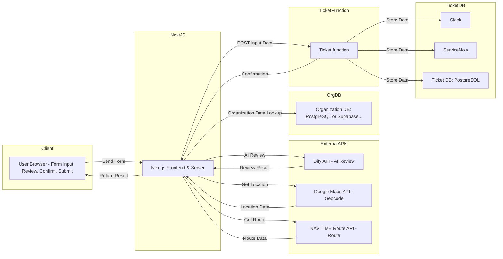

# 出張申請システム

## 概要
企業の国内出張申請をオンラインで完結できるシステムです。複数人での出張申請や、同一行程・個別行程の選択に対応しています。

## 使用技術スタック
### フレームワーク・ライブラリ
- Next.js (App Router)
- React Hook Form
- Zod
- ShadcnUI
- TailwindCSS
- Zustand

### 主要機能
1. 基本情報入力 (Step1)
   - 申請者情報の登録
   - 複数出張者の登録
   - 同一/個別行程の選択
   - 出張分類と目的の設定

2. 宿泊・移動情報入力 (Step2)
   - 出張期間の設定
   - 宿泊地域の選択
   - 宿泊費の自動計算
   - 基準額超過時の理由入力
   
3. その他の機能
   - 複数人での個別行程管理
   - 宿泊費の地域別基準額チェック
   - フォーム間の状態管理
   - 日本語検索対応
   - プログレスバーによる進捗表示

## データフロー想定

## フォームバリデーション
- Zodによる型安全な入力値検証
- 必須項目のチェック
- 日付範囲の整合性確認
- 宿泊費基準額超過のチェック

## UI/UX
- レスポンシブデザイン
- ダークモード対応
- 直感的な操作フロー
- 入力補助機能
  - 日本語検索
  - カレンダー選択
  - プルダウン選択

## セキュリティ
- 入力値のサニタイズ
- フォームデータの検証

